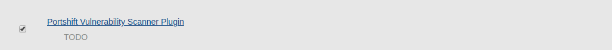
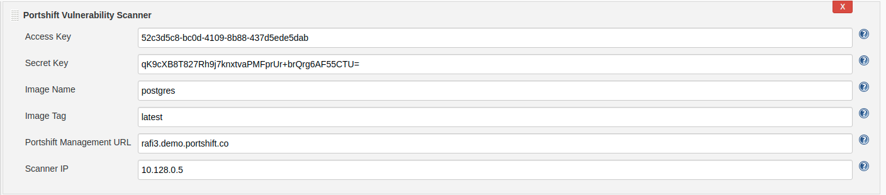
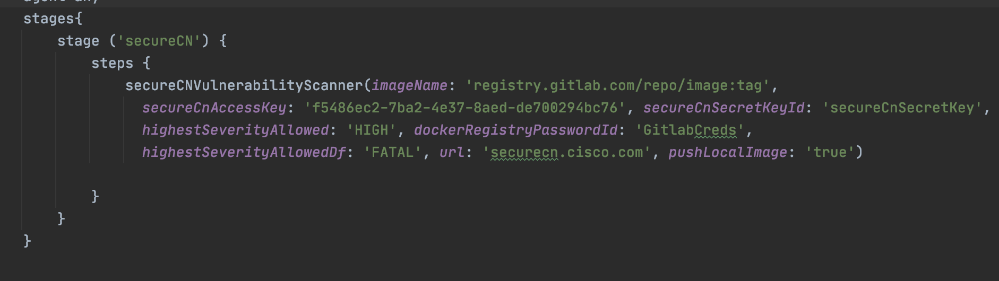
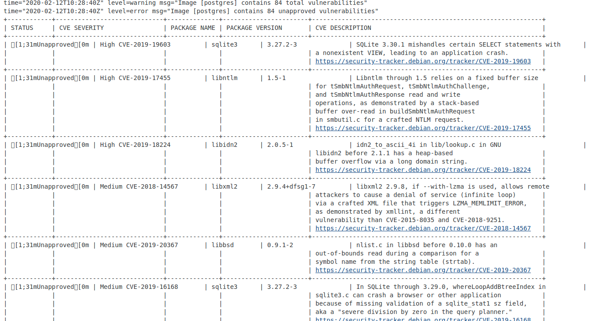

# Panoptica Jenkins CI Plugin #

This plugin for Jenkins enables you to scan docker images for vulnerabilities in Jenkins, push images to registries, and report results to the Panoptica server.

## Operational prerequisites for the plugin  ##

1. Docker must be installed on the same machine as Jenkins. If your job is configured to use a node other than the Master node, then Docker is required only on the build Jenkins node (slave). 
2. A *jenkins* user must be added to the *docker* group, with permission to run Docker:

     ```
     sudo usermod -aG docker jenkins
     ```
## Install and configure the plugin
1. In Jenkins, select **Manage Jenkins** and then select **Manage Plugins** from the list. Ensure that the list of available plugins is up to date. 
2. Select the **Available** tab, search for Panoptica Vulnerability Scanner, and select it.  Click on **Download the Plugin**. This will install the plugin.




## Use the plugin
You can use the plugin in the build process in Freestyle and Pipelines jobs. You can configure the job to scan the image during the build process.

### Freestyle jobs

For Freestyle jobs, add a build step to scan the image with Panoptica, as part of the job configuration. 
1. In Jenkins, in the **Configure** page for a job, click **Add Build Step**.
2. Select **Panoptica Vulnerability Scanner**.



3. Enter the access key for the Panoptica *Service* user. (required)
4. Choose the related secret access key. the secret should be stored as text credential in Jenkins. (required) 
5. Enter the image name. (required)
6. Enter the URL of the Panoptica server (*https://Panoptica.cisco.com/* will be use as default)
7. In case you would like to scan an image that stored in a private registry, choose a Jenkins credential of type username and password representing docker registry credentials.
8. mark the 'push local image' checkbox if you would like to scan a local image, and push it on scan success.
9. Choose the maximum highest severity allowed for CVE. in case the image has a higher severity CVE, the stage will fail.
10. Choose the maximum highest severity allowed for docker file benchmark scan. in case the image has a higher severity vulnerability, the stage will fail.     

### Pipeline jobs
For Pipeline jobs, you can call the scan command from the Jenkinsfile.
 


To the required step in the Jenkinsfile, add the 'PanopticaVulnerabilityScanner' with the following parameters:    
1. PanopticaAccessKey- The access key and secret key for the Panoptica *Service* user. (required)
2. PanopticaSecretKeyId- Credential ID for the related secret access key. the secret should be stored as a text credential in Jenkins. (required) 
3. imageName- Required image name (required)
4. url- The URL of the Panoptica server (*https://Panoptica.cisco.com/* will be used as a default)
5. dockerRegistryPasswordId- In case you would like to scan an image that stored in a private registry, enter a Jenkins credential ID of type username and password representing docker registry credentials.
6. pushLocalImage- Set to 'true' if you would like to scan a local image, and push it on scan success.
7. highestSeverityAllowed- The maximum highest severity allowed for CVE. in case the image has a higher severity CVE, the stage will fail. available values: (CRITICAL, HIGH, MEDIUM, LOW, UNKNOWN)
8. highestSeverityAllowedDf- The maximum highest severity allowed for docker file benchmark scan. in case the image has a higher severity vulnerability, the stage will fail. available values: (FATAL, WARN, INFO)

## Plugin output

You can see the results of the scan in the Console Output.



## Build the plugin (instructions for Ubuntu)

* If JDK is not installed, install it
```
     sudo apt-get update
     sudo apt-get install openjdk-8-jdk
```

* Install Maven3 (must be 3)

*  Build

   When in the root directory, where *pom.xml* resides:
```
     mvn package
```
   **Note**: the first time this command is invoked, many downloads will occur and it will take  some time.
